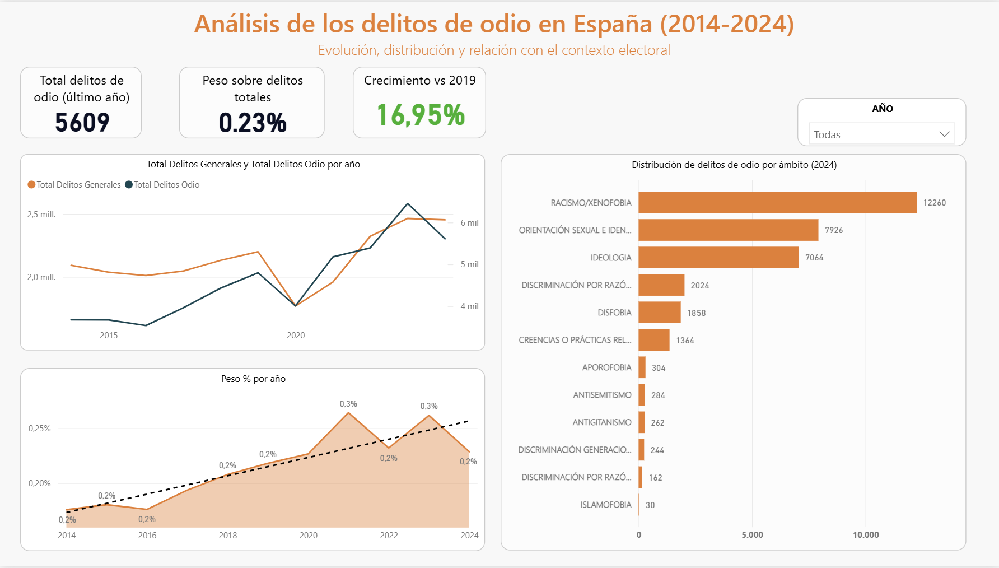
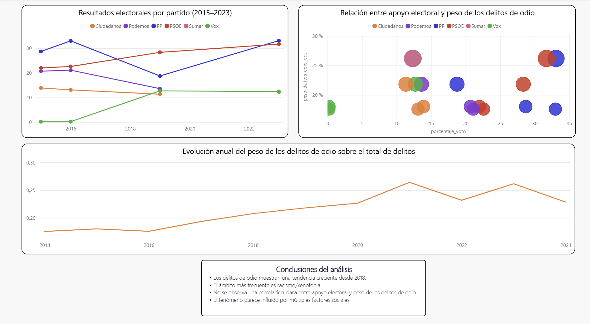

# 📊 Análisis de los delitos de odio en España (2014–2024)

## 📌 Descripción del proyecto

Este proyecto analiza la evolución de los delitos de odio en España entre 2014 y 2024 utilizando datos oficiales.  
El objetivo es estudiar su evolución en el tiempo, su distribución por ámbito y explorar su posible relación con el contexto político y los resultados electorales.

El análisis se ha realizado mediante consultas en **SQL** para la preparación de los datos y mediante **Power BI** para la visualización y creación del dashboard.

---

## 🎯 Objetivos del análisis

- Analizar la evolución de los delitos de odio en España.
- Identificar qué tipos de delitos de odio son más frecuentes.
- Calcular el peso de los delitos de odio sobre el total de delitos registrados.
- Explorar la posible relación entre delitos de odio y resultados electorales.

---

## 🧰 Tecnologías utilizadas

- **MySQL** → limpieza y consultas de datos  
- **Power BI** → modelado de datos y visualización  
- **DAX** → creación de métricas y KPIs  

---

## 📊 Dashboard

### Evolución de los delitos de odio en España

El dashboard muestra la evolución de los delitos de odio en España, su peso respecto al total de delitos y su distribución por ámbitos.

---

### Análisis del contexto electoral

Se analiza la relación entre el porcentaje de voto de los principales partidos políticos y el peso de los delitos de odio. El análisis exploratorio no muestra una correlación directa clara entre ambas variables.

---

## 📈 Resultados principales

- Los delitos de odio muestran una **tendencia creciente a partir de 2018**.
- El ámbito con mayor número de delitos registrados es **racismo/xenofobia**.
- El análisis exploratorio **no muestra una correlación directa clara entre el apoyo electoral a partidos políticos y el peso de los delitos de odio**.

---

## 👤 Autor

Ángel Herrezuelo
