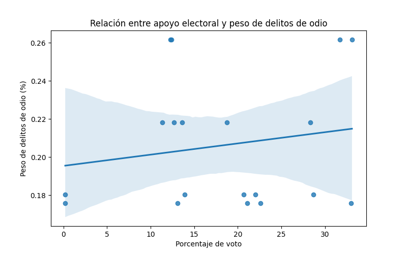

# 📊 Análisis de los delitos de odio en España (2014–2024)

## 📌 Descripción del proyecto

Este proyecto analiza la evolución de los delitos de odio en España entre 2014 y 2024 utilizando datos oficiales.  
El objetivo es estudiar su evolución en el tiempo, su distribución por ámbito y explorar su posible relación con el contexto político y los resultados electorales.

El análisis se ha realizado mediante consultas en **SQL** para la preparación de los datos y mediante **Power BI** para la visualización y creación del dashboard.

---

## 🎯 Objetivos del análisis

- Analizar la evolución de los delitos de odio en España.
- Identificar qué tipos de delitos de odio son más frecuentes.
- Calcular el peso de los delitos de odio sobre el total de delitos registrados.
- Explorar la posible relación entre delitos de odio y resultados electorales.

---

## 🗂️ Dataset

Los datos utilizados en este proyecto proceden de informes oficiales del Ministerio del Interior de España sobre delitos de odio.

Los datasets utilizados incluyen:

- Total de delitos registrados por año
- Delitos de odio por año
- Delitos de odio por ámbito
- Resultados electorales de elecciones generales

Esto hace que el proyecto parezca más riguroso. donde agrego esto

---

## 🧰 Tecnologías utilizadas

- **SQL (MySQL)** → limpieza, transformación y agregación de datos  
- **Power BI** → visualización interactiva y dashboard  
- **Python (pandas, seaborn, matplotlib)** → análisis estadístico y visualización adicional

---

## 📊 Dashboard

### Evolución de los delitos de odio en España

El dashboard muestra la evolución de los delitos de odio en España, su peso respecto al total de delitos y su distribución por ámbitos.

---

### Análisis del contexto electoral

Se analiza la relación entre el porcentaje de voto de los principales partidos políticos y el peso de los delitos de odio. El análisis exploratorio no muestra una correlación directa clara entre ambas variables.

---

## 🐍 Análisis estadístico en Python

Se realizó un análisis adicional en Python para explorar la posible relación entre el porcentaje de voto de los partidos políticos y el peso de los delitos de odio sobre el total de infracciones penales.

Para ello se utilizó la librería **pandas** para el tratamiento de datos y **seaborn/matplotlib** para la visualización.

Se calculó el coeficiente de correlación entre ambas variables:

**r = 0.17**

Este valor indica una **correlación muy débil**, lo que sugiere que no existe una relación lineal significativa entre el apoyo electoral a partidos concretos y el peso de los delitos de odio.

El análisis refuerza lo observado en el dashboard: el fenómeno de los delitos de odio parece estar influido por múltiples factores sociales, económicos y mediáticos, más allá del comportamiento electoral.

### Visualización del análisis

---

## 🔄 Workflow del análisis

El proyecto sigue el siguiente flujo de trabajo:

1. **Extracción de datos**
   - Datos oficiales del Ministerio del Interior
   - Resultados electorales

2. **Transformación y limpieza (SQL)**
   - Creación de tablas agregadas
   - Cálculo de crecimiento interanual
   - Integración de datasets

3. **Visualización (Power BI)**
   - Dashboard interactivo
   - Análisis de tendencias y distribución

4. **Análisis estadístico (Python)**
   - Cálculo de correlación
   - Regresión lineal
  
  ---

## 📈 Resultados principales

- Los delitos de odio muestran una **tendencia creciente a partir de 2018**.
- El ámbito con mayor número de delitos registrados es **racismo/xenofobia**.
- El análisis exploratorio **no muestra una correlación directa clara entre el apoyo electoral a partidos políticos y el peso de los delitos de odio**.

---

## 📂 Estructura del proyecto

analisis-delitos-odio-espana  
│  
├── dashboard  
│   └── delitos_odio_dashboard.pbix  
│  
├── sql  
│   └── analisis_delitos_odio.sql  
│  
├── images  
│   ├── dashboard_general.png  
│   └── analisis_politico.png  
│  
└── README.md

---

## 📌 Conclusiones

- Los delitos de odio muestran una tendencia creciente desde 2018.
- El ámbito más frecuente es racismo/xenofobia.
- El análisis estadístico muestra una **correlación muy débil (r = 0.17)** entre apoyo electoral y peso de los delitos de odio.
- Esto sugiere que el fenómeno está influido por múltiples factores sociales.

---

Fuente de datos: Ministerio del Interior de España  
Portal Estadístico de Criminalidad

---

## 👤 Autor

Ángel Herrezuelo

